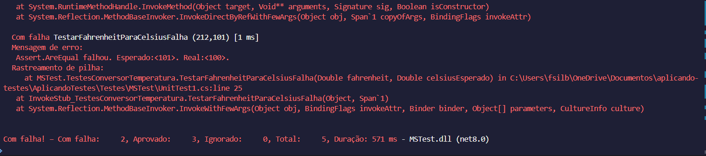

# Aplicando Testes com dotNet

## Introdução
Este documento tem como objetivo esclarecer e explicitar a implementação de 3 tipos de testes unitários utilizando dotNet: MSTest, XUnit e NUnit

- **MSTest:** utiliza o ```[DataRow]``` para trabalhar com parâmetros.
- **XUnit:** utiliza o ```[Theory]``` para indicar que o teste será feito com parâmetros e utiliza o ```[InlineData]``` para passar os parâmetros.
- **NUnit:** utiliza o ```[TestCase]``` para indicar os valores dos parâmetros a serem testados.

## Função a ser testada

```csharp
public static double FahrenheitParaCelsius(double fahrenheit)
        {
            return Math.Round((fahrenheit - 32) / 1.8, 2);
        }
```

## Execução dos testes

### MSTest

#### Sucesso


#### Falha


### XUnit

#### Sucesso


#### Falha


### NUnit

#### Sucesso


#### Falha

